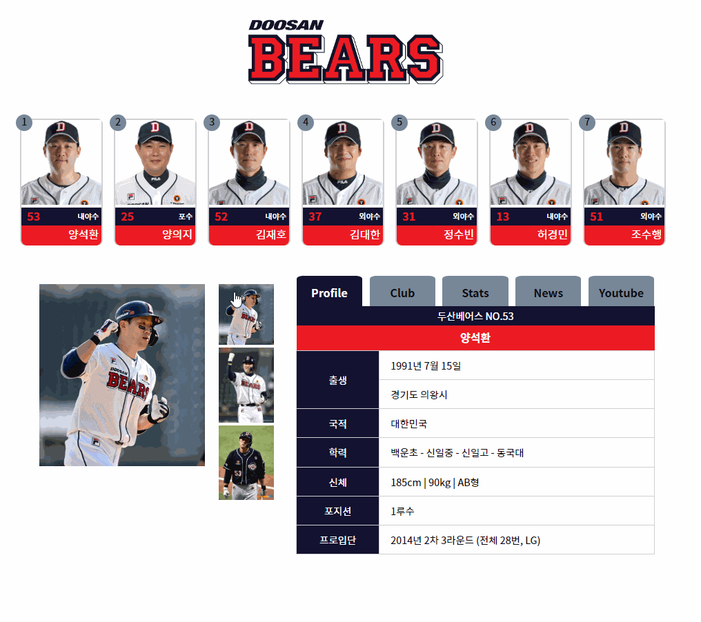

# PP-doosan_bears

## 두산 베어스 선수 정보 페이지 제작 (개인 프로젝트)

| FE / design | 이상연 | [@yeonhub](https://github.com/yeonhub) |
| ----------- | ------ | ----------------------------------- |

## 프로젝트 기술 스택

  

## 컴포넌트 구조

```javascript
src	┌	assets	-	api	┌	DoosanData.js
	│				└	DoosanStatData.js
	└	doosan	┌	Main.js
    			├	DoosanList.js	-	DoosanItem.js
        	        └	DoosanInfo.js	┌	DoosanImg.js
                				└	DoosanMenu.js	-	DoosanCon.js	┌	DoosanProfile.js
                										├	DoosanStat.js
                                                                        			├	DoosanClub.js
                                                                        			├	DoosanNews.js
                                                                        			└	DoosanYoutube.js
```

## 프로젝트 캡쳐


## 기능 구현

<br>

### 1) 객체 데이터 사용

선수들의 기본 프로필, 소속 클럽, 유튜브 링크를 담은 객체 생성

```javascript
export default [
    {
        id: 1,
        no: 53,
        nameno: 'ysh53',
        imgurl: "./images/ysh53.png",
        name: "양석환",
        position: "내야수",
        birth: '1991년 7월 15일',
        birth2: '경기도 의왕시',
        nation: '대한민국',
        eb: '백운초 - 신일중 - 신일고 - 동국대',
        phy: '185cm | 90kg | AB형',
        po: '1루수',
        pro: '2014년 2차 3라운드 (전체 28번, LG)',
        images: [
            { tn: "./images/ysh53/ysh53-1.jpg" },
            { tn: "./images/ysh53/ysh53-2.jpg" },
            { tn: "./images/ysh53/ysh53-3.jpg" },
        ],
        club: [
            { c: 'LG 트윈스 (2014~2021)' },
            { c: '상무 피닉스 야구단 (2019~2020)' },
            { c: '두산 베어스 (2021~)' },
        ],
        youtube: [
            { yt: "8GMe239jPIo" },
            { yt: "bKHnrS795ss" },
            { yt: "x4RJfDlIPBo" }
        ],
    },
	.
	.
	.
```

연도별 성적을 확인할 수 있는 stats 객체 데이터도 생성

```javascript
export const ysh53 = [
    { 연도: 2015, 팀명: "LG", 타율: 0.260, 경기: 125, 타석: 384, 타수: 358, 득점: 36, 안타: 93, 홈런: 8, 타점: 48, 장타율: 0.394, 출루율: 0.293 },
    { 연도: 2016, 팀명: "LG", 타율: 0.276, 경기: 80, 타석: 215, 타수: 203, 득점: 24, 안타: 56, 홈런: 6, 타점: 37, 장타율: 0.424, 출루율: 0.297 },
    { 연도: 2017, 팀명: "LG", 타율: 0.263, 경기: 132, 타석: 496, 타수: 445, 득점: 62, 안타: 117, 홈런: 14, 타점: 83, 장타율: 0.431, 출루율: 0.326 },
    { 연도: 2018, 팀명: "LG", 타율: 0.263, 경기: 140, 타석: 519, 타수: 483, 득점: 53, 안타: 127, 홈런: 22, 타점: 82, 장타율: 0.455, 출루율: 0.303 },
	.
	.
	.
```

<br>
<br>

### 2) 사진 클릭시 해당 선수 데이터 출력


```javascript
const DoosanItem = ({ item, onSelect }) => {
    const { id, imgurl, no, name, position, nameno } = item
    return (
        <>

	// 위에 사진을 클릭 시 onSelect 함수가 실행되며 
	// 해당 선수의 no와 이름+번호인 noname값을 넘겨준다.

            <li data-id={id} onClick={() => onSelect(no, nameno)}>
                
                <p>
                    <em>{no}</em>
                    <strong>{position}</strong>
                </p>
                <span>{name}</span>
            </li>
        </>
    );
};
```

```javascript
    const [data, setData] = useState(dataList[0])
    const statDataMap = { ysh53, yej25, kjh52, kdh37, jsb31, hkm13, csh51 };
    const onSelect = (no, noname) => {

	// no로 data의 index를 찾은 뒤 data를 해당 선수의 객체로 바꿔준다.

        const idx = listData.findIndex(item => item.no === no);
        setData(dataList[idx])

	// 선수 stats의 경우 export를 'ysh53' 같은 noname 형태로 했으므로
	// ' ' 를 제거하기 위해 statDataMap을 추가해 주었다.

        setStatData(statDataMap[noname]);
    };
```

<br>
<br>

### 3) 썸네일 사진 클릭 시 큰 사진 변경


```javascript
const DoosanImg = ({ data }) => {
    const { images } = data;

	// 큰 사진의 기본값은 썸네일 사진의 0번 index이다.

    const [big, setBig] = useState(images[0].tn)

	// useEffect로 images가 바뀔 때 마다 큰 사진을 썸네일의 0번 사진으로 변경
	// 이 코드를 넣지 않으면 선수가 바뀌었을 때 이전 선수의 큰 사진이 그대로 남게된다.

    useEffect(() => {
        setBig(images[0].tn);
    }, [images]);

    const onTn = e => {

	// 썸네일 사진 클릭 시 해당 요소의 src값을 가져와 큰 사진의 src를 변경해 준다.

        setBig(e.target.src)
    }

    return (
        <div className='gallery'>
            <div className="bigimgbox">
                
            </div>
            <ul>
                {
                    images.map((item, idx) =>
                        <li key={idx}></li>
                    )
                }

            </ul>
        </div>
    );
};
```

<br>
<br>

### 4) 메뉴 클릭 시 해당 정보 출력



```javascript
const DoosanMenu = ({ data, statData, onMenu, content }) => {
    return (
        <div className='menubox'>
            <ul className='menu'>

	// 메뉴 탭을 클릭 시 onMenu 함수가 실행이 되는데
	// 함수 호출과 동시에 출력되어야 할 컴포넌트의 이름을 전해준다.

	// 또한 content 변수를 사용해 현재 출력되고 있는 메뉴에 해당하는 요소에
	// on class 를 붙여주는 기능을 삼항연산자를 사용해 구현했다.

                <li onClick={() => onMenu('DoosanProfile')} 
                    className={`submenu ${content === 'DoosanProfile' ? 'on' : ''}`}
                > Profile </li>
                <li onClick={() => onMenu('DoosanClub')} 
                    className={`submenu ${content === 'DoosanClub' ? 'on' : ''}`}
                > Club </li>
                <li onClick={() => onMenu('DoosanStat')} 
                    className={`submenu ${content === 'DoosanStat' ? 'on' : ''}`}
                > Stats </li>
                <li onClick={() => onMenu('DoosanNews')} 
                    className={`submenu ${content === 'DoosanNews' ? 'on' : ''}`}
                > News </li>
                <li onClick={() => onMenu('DoosanYoutube')} 
                    className={`submenu ${content === 'DoosanYoutube' ? 'on' : ''}`}
                > Youtube </li>
            </ul>
            <DoosanCon data={data} statData={statData} content={content} />
        </div>
    );
};
```

```javascript
    const onMenu = (menu)=>{

	// onMenu 함수는 Main 컴포넌트에서 menu 값을 받아 출력될 content를 변경해준다.

        setContent(menu)
    }
```

```javascript
const componentMap = {

	// key값만 입력할 시 value값은 key값과 동일하게 된다.

    DoosanProfile, DoosanStat, DoosanClub, DoosanNews, DoosanYoutube
};

const DoosanCon = ({ data, statData, content }) => {

	// 메뉴 탭 클릭시 전달받은 content를 위 componetnMap에서 찾아 
	// Component 값으로 할당한다.

    const Component = componentMap[content] || null;

    return (
        <div className='con'>

	// 해당 Component 값과 일치하는 컴포넌트가 출력된다.

            {Component && <Component data={data} statData={statData} />}
        </div>
    );
};
```

<br>
<br>

### 5) 네이버 news API (미완성)

네이버 검색 api를 이용해 해당 선수의 최신 뉴스를 가져오고 싶었다.

```javascript
    useEffect(() => {
        axios
            .get("/v1/search/news.json", {
                params: {

	// 검색어는 선수 이름(name), 뉴스 카테고리는 스포츠로 설정

                    query: `${name}`,
                    display: 5,
                    start: 1,
                    sort: 'sim',
                    news_type: 'sports',
                    title: 'true',
                },
                headers: {
                    'X-Naver-Client-Id': process.env.REACT_APP_NAVER_CLIENT_ID,
                    'X-Naver-Client-Secret': process.env.REACT_APP_NAVER_CLIENT_SECRET,
                },
            })

	// axios에 성공하게 되면 기사 내용이 비어있는 경우 (포토기사입니다) 라는 내용이
	// 기사 내용에 들어가도록 했다.

            .then((response) => {
                const items = response.data.items.map((item) => ({
                    title: item.title.replace(/<\/?b>/g, '').replace(/'/g, '').replace(/&/g, '').replace(/"/g, ''),
                    description: item.description ? item.description.replace(/<\/?b>/g, '').replace(/'/g, '').replace(/&/g, '').replace(/"/g, '') : "(포토기사입니다)",
                    link: item.link
                }));
                setNewsItems(items);
            })
            .catch((error) => {
                console.error(error);
            });
    }, [name]);
```

#### 5-1) CORS 문제


axios의 get 링크에 "https://openapi.naver.com" 를 넣으니 CORS 오류가 발생했다.

구글링을 해보니 세부 이유는 여러가지가 있지만 웹에서 다른 도메인에 접근할 때 보안상의 이유로 공유를 제어한다는 것이였다.

이를 해결하기 위해 찾아보던 중 proxy 설정을 하면 된다기에 proxy middleware 라이브러리를 설치해 앞 주소를 설정했다.


<br>

#### 5-2) 배포 불가능

proxy를 설정해서 CORS를 우회하는 방법은 개발환경(로컬)에서만 가능하고 배포시 해결이 불가능하다. 따라서 github pages 같은 정적 서버에선 사용이 불가능하고, 동적 서버에 node를 활용한 백엔드 작업이 필요하다.

백엔드에서 실시간으로 API 데이터를 호출해서 넘겨주면 프론트에서 출력하는 것 같다.

api를 가져오는 node를 공부해서 구현해보려 했으나 잘 되지 않았다.

또한 백엔드를 업로드 할 호스팅 서버를 구축해야 하는데 이후 작업은 node를 배운 뒤 추가해야 할 것 같다.


[@Node.js 추가 버전](https://github.com/yeonhub/PP-doosan_bears_node)